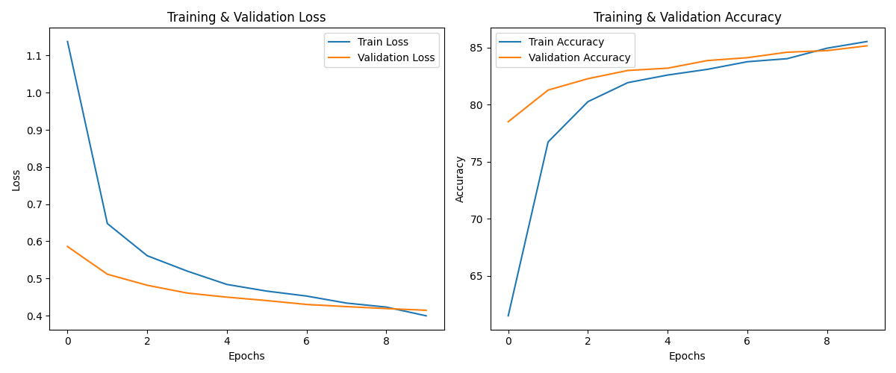

# Self-Supervised Learning to learn Visual Representations for FashionMNIST
This project investigates self-supervised learning techniques for extracting image representations, focusing on their effectiveness in downstream classification tasks. 


## Creating Environment

```
$ conda env create --name ssl-representations --file environment.yml
$ conda activate ssl-representations
```

## Convolutional Autoencoder for SSL

### Unsupervised Pretraining 
An Convolutional autoencoder is trained on the entire dataset without labels. The objective is to minimize the reconstruction error, forcing the encoder to learn a compressed, latent representation of the data.

### Supervised Fine-Tuning
After pretraining, the decoder part of the autoencoder is discarded. An MLP Block is added to the encoder to perform and benchmark the learned representations in the form of classifcation with only using 10% of the labelled samples the Autoencoder model saw.

To reproduce the results run: 
```python

$ python conv_ae_mlp_finetune.py

```

<!-- attach image from assets -->


## Variational Autoencoder for SSL

Enhancing our approach, we integrate a ResNet-based encoder within the autoencoder framework for more abstract representation learning. Post-training, a two-layer MLP classifier evaluates the learned representations on classification tasks, similar to the first method.

To reproduce the results run: 
```python
$ python vae_mlp_finetune.py

```

**Note**: The VAE model has some dimensionality issues with the decoder. So it throws an error. Will be worked on soon.

## Simple Framework for Contrastive Learning of Visual Representations


Utilizing SimCLR, we apply contrastive learning with a ResNet encoder and NT-Xent loss to learn visual representations. For downstream evaluation, we remove the projection head, attach a single-layer MLP, and fine-tune the model on classification tasks.

To reproduce the results run: 
```python
$ cd ContrastiveLearning
$ python train.py
```


